# 灯下读书 · 微信小程序

一盏灯，一卷书。为大学生设计的公版古籍阅读与读书打卡小程序，运行于微信小程序平台，按 App 规范实现登录、云端同步与多端导入。

## 功能一览

- **书库**：内置 20 本公版古籍（四书注疏、道德经、庄子、传习录、菜根谭、唐诗三百首、古文观止……），正文以 deflate+base64 压缩内置（`data/books_data.js`），不依赖网络与文件系统
- **阅读器**：章节感知（顶部实时显示当前卷/章）、4 档字号、夜间模式、目录双页签（目录/书签，当前章高亮）、长按段落复制/加书签、进度自动保存与恢复
- **多端导入**：PDF（微信内置阅读器打开）/ EPUB（内置解析器，自动生成章节目录）/ TXT / Word / Excel / PPT 等，无格式与大小限制；电脑端直选本地文件、手机端微信/QQ 聊天文件、批量多选、重复跳过
- **阅读体验**：四套纸张主题（米白/宣纸/护眼/夜间）、三种字体（宋/楷/黑）、沉浸模式、自动滚动三档、全书全文搜索、书摘分享卡（canvas 生成可存相册）
- **读书管理**：每日阅读目标（15/25/30/45 分钟）+ 达标动效、阅读时长统计、连续打卡、近 7 天柱状图、本月打卡日历、每日阅读提醒（订阅消息）
- **摘抄与报告**：书签跨书汇总成「我的摘抄」（一键复制导出）、阅读报告卡（canvas 生成，保存相册分享）、全界面动效
- **登录体系**：微信一键登录（wx.login → token 会话）、头像昵称授权（chooseAvatar/nickname 官方组件）、用户协议/隐私政策、游客模式、退出登录
- **云同步**（可选）：微信云开发，进度/统计/书签/自藏书多端同步，正文备份云存储

## 界面预览

| 书架 | 阅读页 | 夜间模式 | 目录面板 |
|---|---|---|---|
| 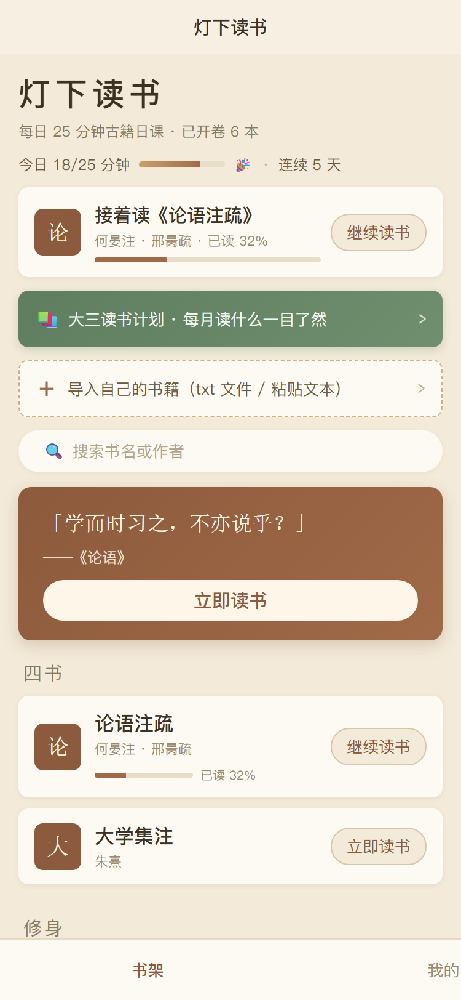 | 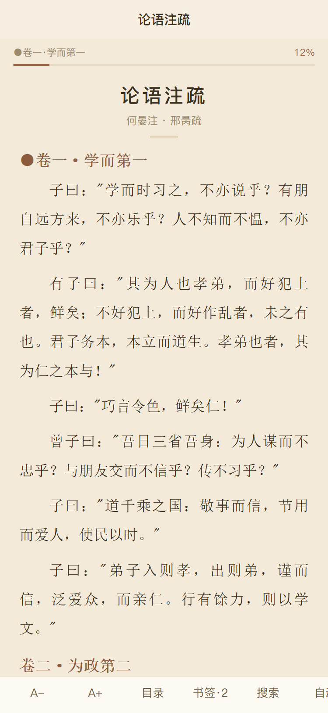 | 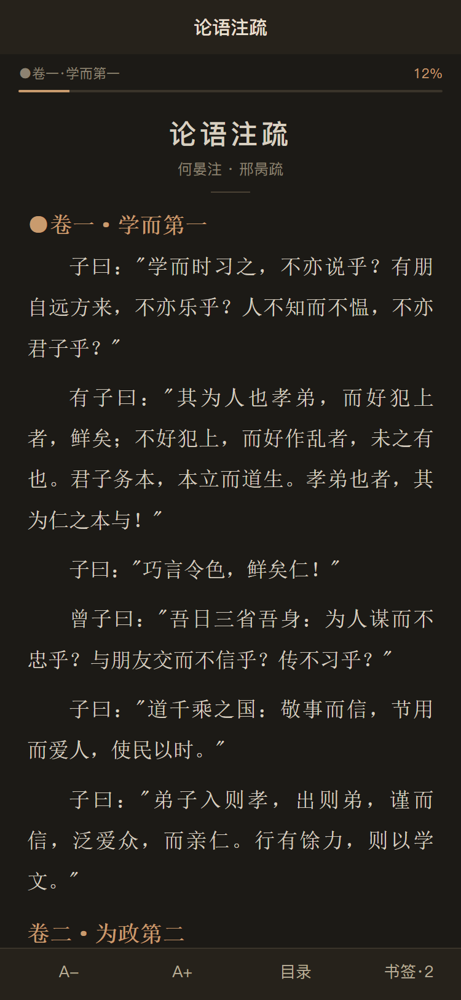 | 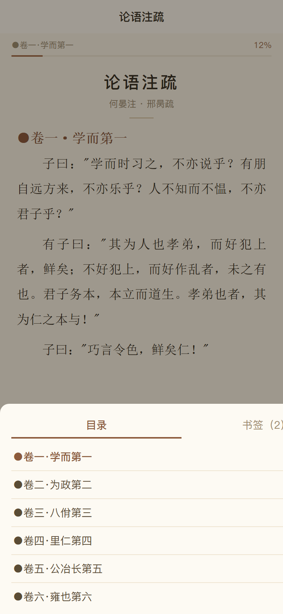 |

| 我的 | 导入 | 登录 | 完善资料 |
| 书摘卡 | 主题面板 | 护眼主题 | |
|---|---|---|---|
|  | 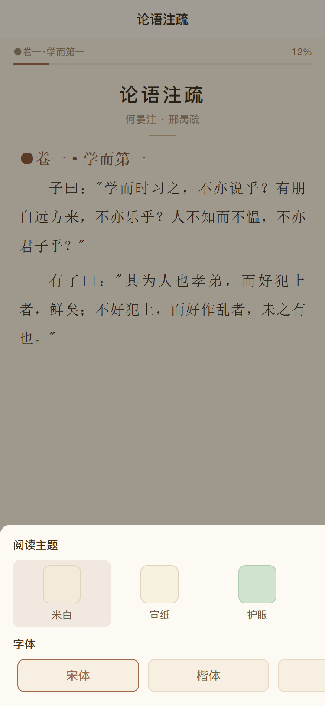 | 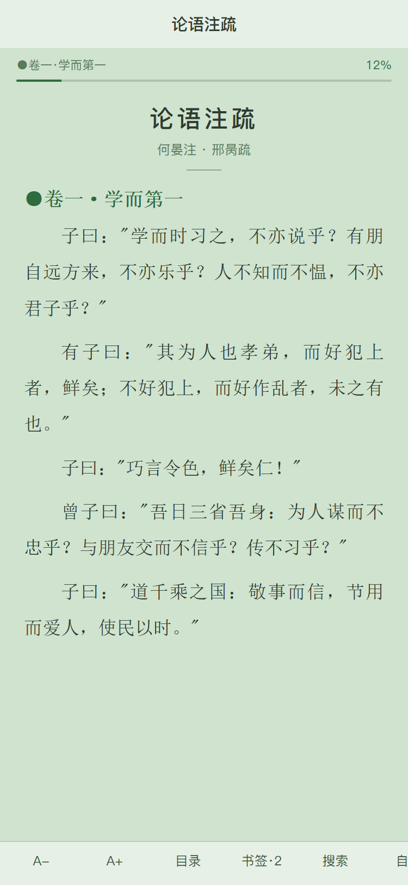 | 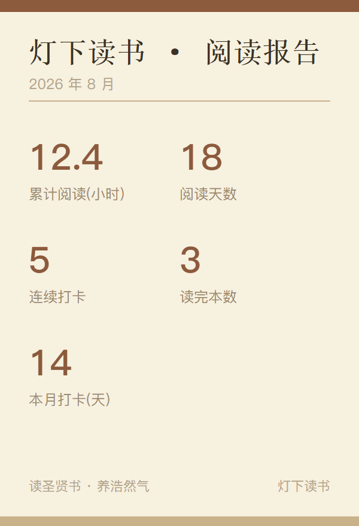 |
|---|---|---|---|
| 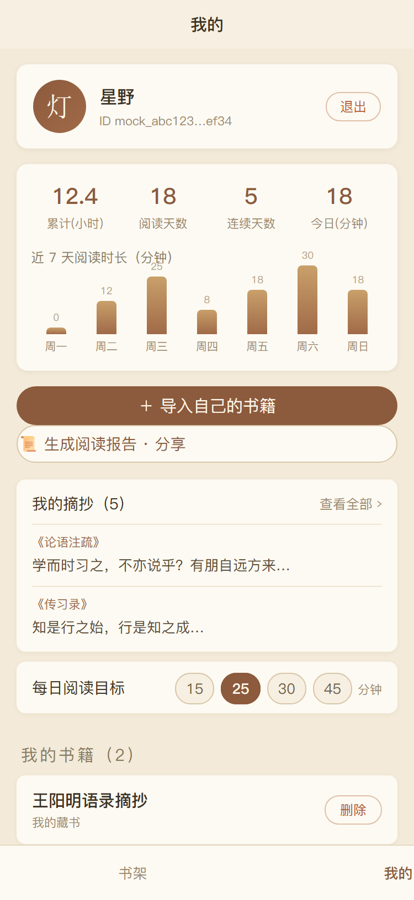 | 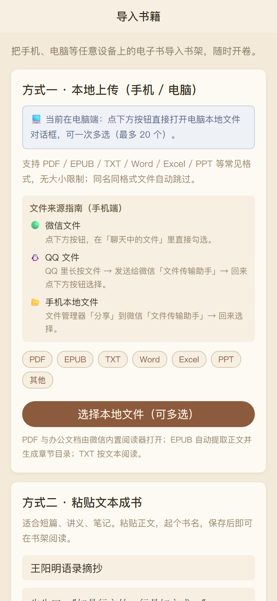 | 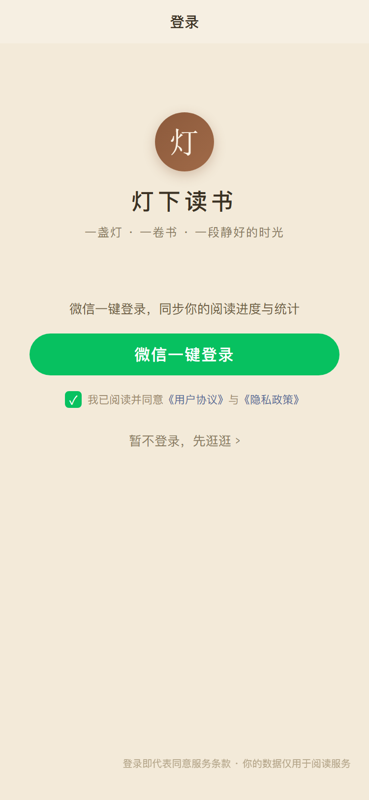 | 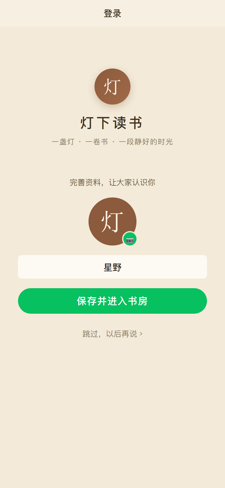 |

## 目录结构

```
dengxia-dushu/
├── app.js / app.json / app.wxss       全局（tabBar、会话、统计、云同步）
├── pages/
│   ├── index/        书架（每日一句、接着读、搜索、分类书单）
│   ├── reader/       阅读器（正文/EPUB/文档三种模式）
│   ├── mine/         我的（登录卡片、统计、打卡日历、自藏书管理）
│   ├── import/       多端导入（电脑本地文件 / 聊天文件 / 粘贴文本）
│   ├── login/        登录（一键登录 + 完善资料）
│   └── agreement/    用户协议 / 隐私政策
├── services/
│   ├── auth.js       登录会话（wx.login → token，含云开发/自建后端接入点）
│   ├── cloud.js      云同步（拉取/推送/云存储上传下载）
│   ├── formats.js    格式识别 + EPUB 解析（fflate 解压）
│   └── remind.js     订阅消息提醒（填模板 ID 即生效）
├── utils/books.js    书库清单 + 解压读取（pako + 内置数据）
├── data/books_data.js   20 本古籍压缩数据（由 tools/build_books.js 生成）
├── libs/             pako.min.js / fflate.min.js（运行时依赖，已随仓库）
├── cloudfunctions/
│   ├── login/        微信登录云函数（getWXContext 取 openid）
│   └── sync/         阅读数据同步云函数（readers 集合）
├── tools/build_books.js   书库构建脚本（node 运行）
├── docs/             使用说明 / 验收清单 / 上线清单 / 读书计划 / 书单说明
└── screenshots/      界面预览图
```

## 快速开始

1. 安装[微信开发者工具](https://developers.weixin.qq.com/miniprogram/dev/devtools/download.html)，微信扫码登录
2. 「导入项目」→ 选择本目录 → AppID 填 `touristappid`（游客模式）或点「测试号」
3. 点「编译」→ 模拟器里点任意书的「立即读书」即可开读
4. 真机预览：AppID 换成测试号 → 点「预览」→ 手机扫码

> 首次编译若提示基础库版本低，把 `project.config.json` 的 `libVersion` 改成工具当前版本。
> 你的 AppID 已写入过 `project.config.json`（wx6882…），换账号时记得修改。

## 详细操作

### 1. 书库（内置 20 本公版古籍）

正文压缩内置，无需网络。书单见 `utils/books.js`，来源与授权说明见 `docs/书单说明.md`。

**新增/更换内置书**：
1. 把 txt 放进 `F:\新建文件夹 (2)`（或改 `tools/build_books.js` 的 `SRC` 与 `BOOKS` 清单）
2. 项目目录运行 `node tools/build_books.js` 重新生成 `data/books_data.js`
3. 在 `utils/books.js` 的 `list` 中登记书名/作者/分类
4. 注意主包上限 2MB（当前约 1.78MB）

### 2. 导入自己的书（多端、多格式）

- **电脑端**：微信电脑版打开小程序 → 导入页自动识别为电脑端 → 「选择本地文件（可多选）」直接弹系统文件对话框，一次最多 20 个
- **手机端**：文件发到微信「文件传输助手」后从聊天记录选择；QQ 文件：QQ 长按 → 发送给微信「文件传输助手」→ 回来选择；手机本地文件：文件管理器「分享」到微信「文件传输助手」
- 支持 PDF（微信内置阅读器）/ EPUB（内置解析）/ TXT / Word / Excel / PPT 等，无格式与大小限制，同名同格式自动跳过
- 自藏书保存在 `USER_DATA_PATH/mybooks/`（配额约 200MB），卸载或清缓存会丢失；开通云开发后自动备份云存储

### 3. 登录

- 未接后端时为本地模拟登录（mock openid/token），阅读功能不受影响
- **接入真实登录（二选一）**：
  - *微信云开发（推荐）*：工具点「云开发」开通 → 上传 `cloudfunctions/login` → `services/auth.js` 的 `USE_CLOUD` 改为 `true`
  - *自建后端*：实现 `services/auth.js` 的 `remoteExchange()`（`wx.request` 调你的接口，域名需配置合法域名），后端用 code 调微信 `code2session` 换 openid 并签发 token

### 4. 云同步（进度 / 统计 / 书签 / 自藏书）

1. 开通云开发并上传 `cloudfunctions/login`、`cloudfunctions/sync` 两个云函数
2. 云开发控制台创建数据库集合 `readers`（权限「仅创建者可读写」即可，云函数走服务端不受限）
3. `services/auth.js` 的 `USE_CLOUD` 改为 `true`
4. 登录后启动自动拉取云端数据按时间戳合并；本地变更防抖 1.5s 自动推送；自藏书正文上传云存储、跨端打开自动下载

### 5. 每日阅读提醒（订阅消息）

1. 公众平台「功能 → 订阅消息」选用模板
2. 模板 ID 填入 `services/remind.js` 的 `TEMPLATE_ID`
3. 服务端（云函数定时触发器或自建后端）调 `subscribeMessage.send` 推送

### 6. 发布上线

完整流程见 `docs/上线清单.md`，要点：注册小程序号 → 完善信息/类目 → **填写用户隐私保护指引**（审核必查）→ 换 AppID → 上传 → 提审 → 发布。全部书籍为公版古籍，无版权风险。

## 验收

逐项测试见 `docs/验收清单.md`（环境/书架/阅读/登录/导入/真机/云同步 40+ 项）。

## 常见问题

- **「无法打开文章」**：历史版本曾依赖 `FileSystemManager.readFile` 读代码包，部分环境不支持；v8 起已改为 require 数据模块 + pako 解压，任何环境可读。若仍报错请带弹窗全文提 issue
- **真机调试报 wxml 语法错误**：重新编译或「清缓存 → 全部清除」后重试；wxml 以仓库最新版本为准
- **包体积**：主包当前约 1.78MB（上限 2MB），新增内置书请控制体积或压缩正文
- **QQ 文件无法直接选**：微信小程序沙箱不能读 QQ，走「QQ → 文件传输助手 → 小程序」两步即可

## 数据与版权

- 内置 20 本书均为公版古籍（来源：古腾堡计划、国学导航、中国哲学书电子化计划、国家图书馆扫描件等），详情见 `docs/书单说明.md`
- 自藏书内容请确保来源合法
- 本项目代码为学习/个人使用示例

## 版本历史

v1 书库与阅读器 → v2 自藏书导入 → v3 智能阅读/统计/打卡 → v4 登录体系 → v5 云同步 → v6 交付校验 → v7-v8 打开失败修复（压缩数据模块）→ v9 多格式导入（PDF/EPUB）→ v10 多端批量上传 → v11 微信/QQ 文件导入指南 → v12 阅读体验升级 → v13 摘抄汇总/阅读报告卡/动效打磨。详见 `docs/使用说明.md`。